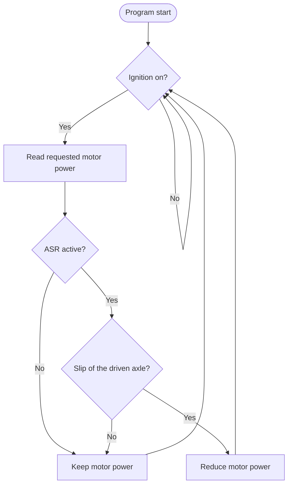

# Traction control flow chart

In the firmware, "Keep motor power" means that the power follows the pedal with a limited
ramp; "Reduce motor power" ramps the PWM down by `ASR_RAMP_DOWN` per millisecond
(see `firmware/E_Kart/Traction_Control.cpp`).
